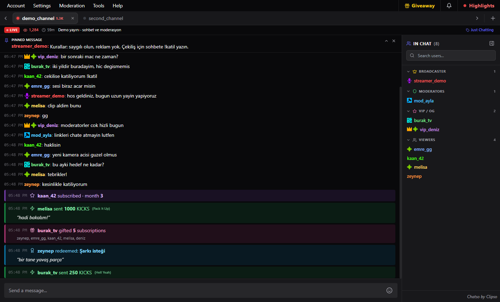
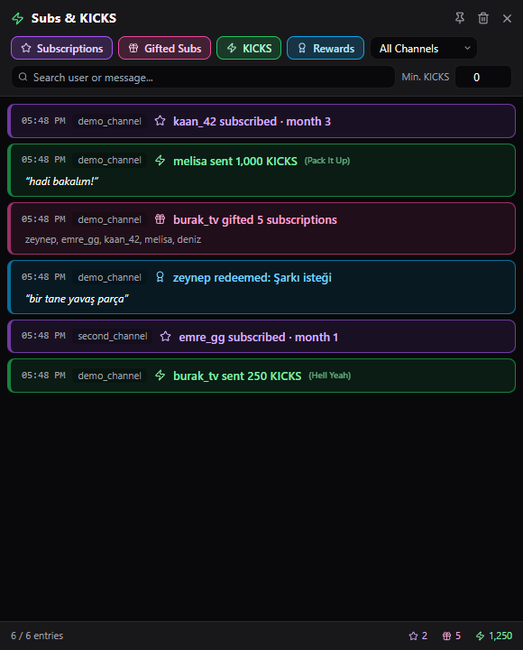
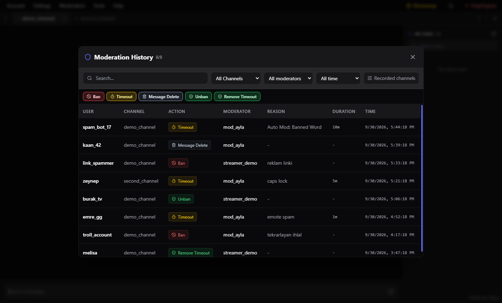
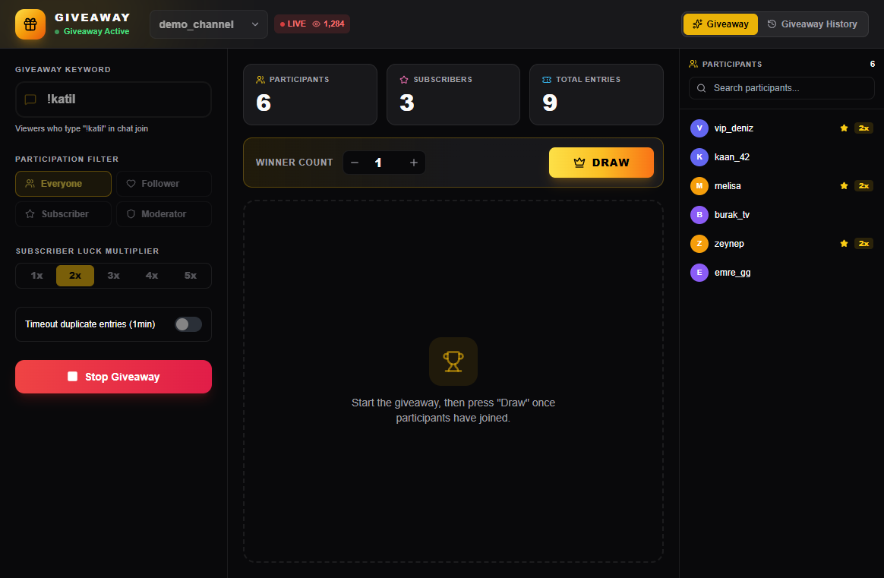
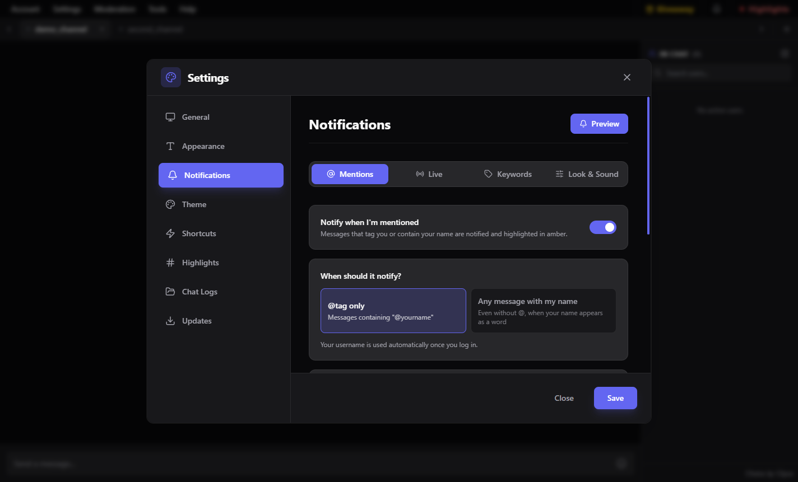
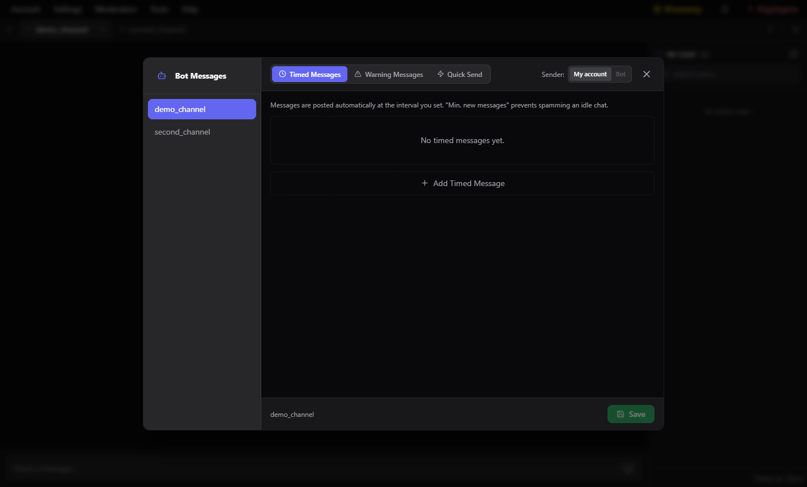
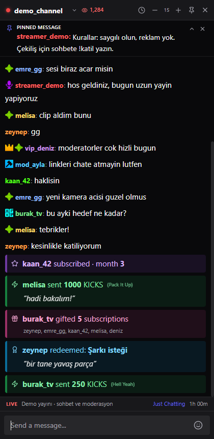
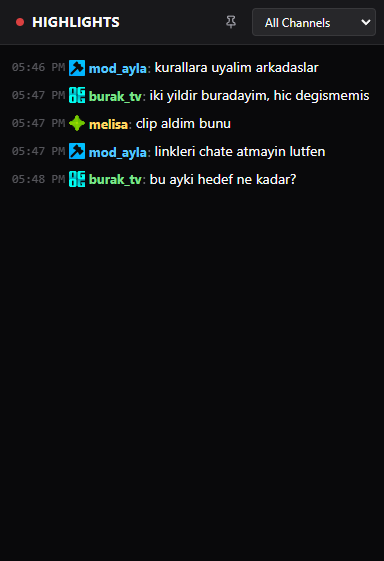

# Chatso

**Kick.com için masaüstü sohbet ve moderasyon uygulaması.**

🇬🇧 [English README](README.md)

Windows için ücretsiz. Kick hesabınızla giriş yapar, Kick'in resmî API'sini kullanır.

---

## Öne çıkanlar

- **Çoklu kanal sekmeleri** — moderatör olduğunuz tüm kanallar tek pencerede; canlı durumu, izleyici sayısı ve yayın başlığıyla.
- **Hızlı moderasyon** — kısayol tuşlarıyla zaman aşımı ve ban, kendi sebebinizle ban, mesaj silme, toplu moderasyon ve kelime bazlı otomatik moderasyon.
- **Abonelik ve KICKS akışı** — abonelikler, hediye abonelikler, KICKS hediyeleri ve kanal puanı ödülleri hem sohbetin içinde hem de filtrelenebilir ayrı bir pencerede.
- **Yayıncı paneli** — yayın başlığı ve kategorisi, abone sayıları, KICKS liderlik tablosu, kanal puanı ödülleri ve reklam arası.
- **Çekiliş** — anahtar kelimeyle katılım, abonelere şans çarpanı, katılımcı arama ve kazanandan tek tıkla sohbet geçmişine geçiş.
- **Akıcı sohbet** — mesaj sınırı yok; sanallaştırılmış liste sayesinde mütevazı donanımda bile akış akıcı kalır.

---

## Yakından bakış

### Abonelikler ve KICKS

Gelen her abonelik, hediye abonelik, KICKS hediyesi ve ödül talebi tek listede. Tür, kanal, kullanıcı/mesaj metni ve minimum KICKS değerine göre filtrelenir. Pencere çalışırken üstte kalabilir.

### Moderasyon geçmişi

Uygulama üzerinden yapılan her işlem; işlem türü, kanal, moderatör ve zaman aralığına göre aranabilir ve filtrelenebilir. Hangi kanalların kaydedileceğine de siz karar verirsiniz.

### Çekiliş

Anahtar kelimeyi yazan izleyicileri toplar, abonelere şans çarpanı verir, tekrarlayan katılımları engeller. Katılımcılar aranabilir; kazanana tıklayınca profili ve sohbet geçmişi açılır.

### Bildirimler

Etiketlendiğinizde, belirlediğiniz kelimeler geçtiğinde veya bir kanal yayına girdiğinde bildirim alırsınız — sekmesi açık olmayan kanallar için de. Üç bildirim tasarımı, ekran konumu, süre ve özel ses seçeneğiyle.

### Bot mesajları

Kanal başına zamanlı mesajlar ve uyarı mesajları. "En az şu kadar yeni mesaj" koşulu botun boş sohbete konuşmasını engeller; mesajlar kendi hesabınızdan da gönderilebilir.

### Dikey sohbet penceresi

Yayın yaparken ikinci ekrana koymak için tasarlanmış dar sohbet penceresi: mesaj gönderme, yazı boyutu, zaman damgası ve her zaman üstte tutma.

### Vurgulanan mesajlar

Vurgulama kelimelerinize uyan mesajlar kendi penceresinde toplanır; yayın bittikten sonra hepsine tek yerden bakabilirsiniz.

---

## Tüm özellikler

**Sohbet**
- Kick global ve kanal emoteları, ayrıca 7TV emoteları
- `:` ile emote tamamlama, yanıtlama, mesaj silme
- Kanala sabitlenen mesajın sohbetin üstünde gösterimi
- Rol renkleri (yayıncı / moderatör / VIP-OG / izleyici) ve rozet bazında görünürlük
- Rollere göre gruplanmış, aranabilir izleyici listesi
- Mesaj sınırı yok; yukarı kaydırınca akış durur, tek tıkla canlıya döner

**Moderasyon**
- Kısayol tuşlarıyla zaman aşımı ve ban
- Klasik ban sebep göndermez; "Sebeple banla" ile kendi gerekçenizi yazarsınız
- Mesaj silme ve profil ekranından kullanıcının sohbet geçmişi
- Toplu moderasyon (listeden ban/unban)
- Otomatik moderasyon: ban ve zaman aşımı kelimeleri, spam ve emote spam koruması
- Hangi moderatörün hangi işlemi yaptığı sohbetin içinde görünür
- Filtreli moderasyon geçmişi ve kanal bazında kayıt kontrolü

**Yayıncı paneli**
- Yayın başlığı, kategori ve etiketler — sohbet penceresindeki kısayoldan da
- Abone sayıları, KICKS liderlik tablosu, kanal puanı ödülleri ve talepleri
- Reklam arası

**Bildirimler**
- Etiketlenme, kendi kelimeleriniz ve yayına giren kanallar
- Yayın bildirimleri ile diğer bildirimler ayrı sekmelerde
- Deneme bildirimleri gösterilir ama listeye kaydedilmez

**Diğer**
- Seçtiğiniz kanallar için sohbeti dosyaya kaydetme
- Türkçe ve İngilizce arayüz
- Otomatik güncelleme

---

## Kurulum

1. [Son sürüm](../../releases/latest) sayfasından `Chatso Setup.exe` dosyasını indirin.
2. Çalıştırın. Windows SmartScreen uyarısı çıkarsa **Ek bilgi → Yine de çalıştır** deyin.
3. Uygulamayı açıp **Account → Login** ile Kick hesabınıza giriş yapın. İzni verdiğinizde tarayıcı sekmesi kendiliğinden kapanır.
